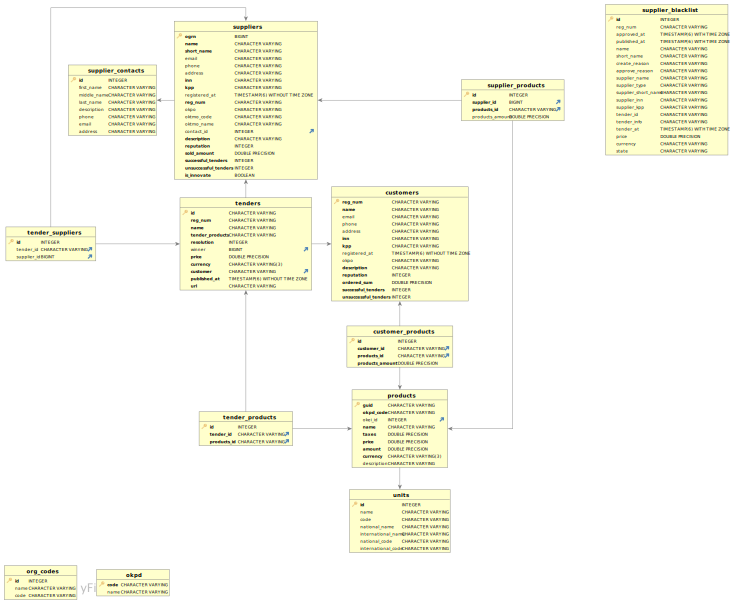

# rosatom-hack
Repository for hackathon

RUN

```shell
chmod +x pre_deploy.sh
./pre_deploy.sh
docker-compose up --build -d
```

```shell
chmod +x pre_deploy.sh
./pre_deploy.sh
docker-compose up --build -d
```

Database structure

